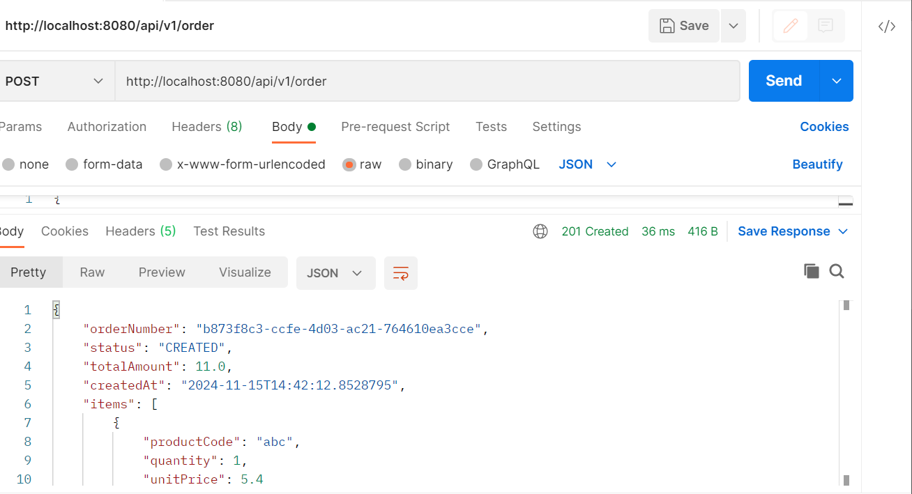

curl --location --request POST 'http://localhost:8080/api/v1/order' \
--header 'Content-Type: application/json' \
--data-raw '{
"items": [
{
"productCode": "abc",
"quantity": 1,
"unitPrice": 5.4
},
{
"productCode": "abqc",
"quantity": 1,
"unitPrice": 5.6
}
]
}'